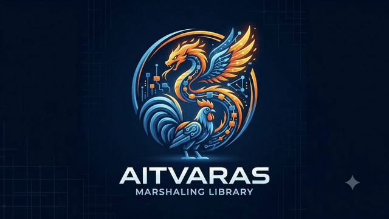
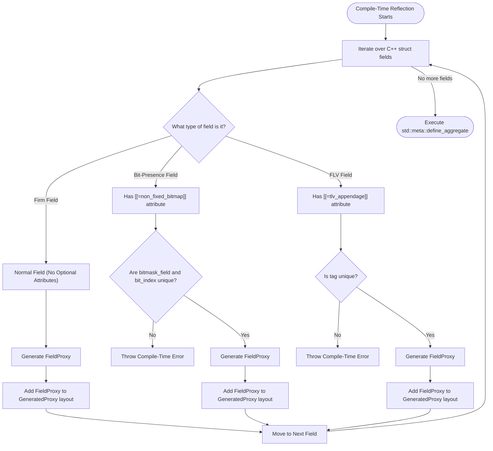

# Aitvaras

<div align="center">
  
</div>

Aitvaras is a modern, zero-allocation binary protocol marshaling framework written in C++26. It leverages compile-time reflection (`std::meta`) to provide a declarative, robust, and highly performant way to marshal and unmarshal complex binary protocols.

### The Mythos & Logo
In Lithuanian mythology, an **Aitvaras** is a supernatural nature spirit—often taking the form of a rooster, a flying dragon, or a flaming meteorite—that brings wealth, fortune, and treasure to its master with incredible speed and agility. 

We chose this name because the framework is designed to bring you the "treasure" of ultra-low latency parsing and zero-allocation binary data extraction with the raw speed of C++26. The glowing, fast-moving logo embodies this blistering speed, agility, and the "magical" ease with which the framework seamlessly unpacks complex binary formats using compile-time reflection.

## Key Features

- **Zero-Allocation**: Works entirely with memory spans (`std::span`), allowing for parsing and serialization without any dynamic heap allocations.
- **C++26 Reflection (`std::meta`)**: Automatically generates serialization logic at compile-time by inspecting the layout and attributes of your C++ structures.
- **Declarative Annotations**: Define protocol layouts directly in native C++ using structural attributes:
  - `[[=little_endian{}]]` / `[[=big_endian{}]]`: Indicates the byte order of a field or entire struct. Aitvaras automatically byteswaps fields at runtime when the protocol's endianness differs from the native system architecture. Supports both struct-level and field-level overrides.
  - `[[=padded_string{' ', N}]]`: Identifies a fixed-length string of `N` bytes that is padded with a specific character (e.g., a space). The framework automatically strips the trailing padding when reading, and applies the padding when writing.
  - `[[=null_terminated_string{N}]]`: Defines a string field up to a maximum length of `N` bytes that terminates early if a null byte is encountered.
  - `[[=enumeration{^^EnumType}]]`: Transparently maps an integer field to a strongly typed C++ `enum class`.
  - `[[=fixed_point{D}]]`: Identifies an integer field as representing a fixed-point decimal, applying a decimal scaling factor of `D` places upon JSON serialization or higher-level access.
  - `[[=non_fixed_bitmap{^^bitmask_field, BIT}]]`: Denotes an optional field whose presence in the buffer is dictated by the value of `BIT` in the specified `bitmask_field`.
  - `[[=tlv_appendage{TAG}]]`: Marks the field as a dynamic Type-Length-Value (TLV) appendage positioned at the tail end of the message. Only parsed if the appendage identifier matches `TAG`.
  - `[[=tlv_region_length{}]]`: Identifies the field that specifies the total length (in bytes) of the TLV region at the end of the message.
  - `[[=length_precedes{^^Type, ADJ}]]`: Indicates that the size of this binary blob or string is determined by parsing a preceding integer of type `Type`, with an optional offset `ADJ`.
  - `[[=default_invoke{^^func}]]`: Defines a `consteval` function that provides the default value for the field during initialization.
- **Optional Fields & Bitmaps**: Natively supports structures that contain presence bitmaps controlling the availability of optional fields.
- **Dynamic Appendages (TLV)**: Natively parses and writes Type-Length-Value (TLV) sequences appended to the end of structured messages, with a fully typed mutator and accessor API.
- **JSON Serialization**: Automatically generate JSON representations (`to_json`) of binary structures using compile-time reflection, supporting full verbosity configuration for binary blob appendages.
- **Structural Iteration**: Execute logic across subsets of message fields via compile-time generated Visitor pattern methods (`for_each_fixed`, `for_each_optional`, `for_each_all`).
- **Safety First**: Constrained mutation operations to prevent misuse (e.g. read-only messages cannot be written to).

## Testing & Validation Protocols

To test the extreme flexibility and capabilities of the Aitvaras framework, we implemented the parsers and structures for several complex, real-world financial binary protocols. These implementations validate that Aitvaras can gracefully handle the stringent and diverse requirements of low-latency market data and order entry systems.

- **OUCH 5.0**: Tests complex message structures and fixed-length ASCII field padding constraints.
- **SoupBinTCP 4.00**: Tests robust byte-aligned framing and message sequencing structures.
- **SEED**: Tests Aitvaras's ability to seamlessly handle **Presence Bitmaps** and **Optional Fields**.
- **RAKE**: Tests Aitvaras's ability to seamlessly handle **Dynamic Appendages** (Type-Length-Value sequences) attached to the end of binary messages.

> **Note**: The specification documents for these protocols (`specs/`) are included strictly for demonstration and testing purposes. Aitvaras uses them to showcase its capability to define and parse extremely strict structural layouts. OUCH and SoupBinTCP are the property of Nasdaq, Inc. SEED and RAKE are the property of the Texas Stock Exchange. No ownership of these protocols is claimed (see the `CREDITS` file for more details).

## Compile-Time Code Generation Workflow

Aitvaras evaluates your protocol structures at compile time to build highly-optimized marshaler layouts. The diagram below details the steps the framework takes as it encounters firm (fixed), bit-presence, and dynamic FLV (TLV) fields.



## Usage Example

Defining a protocol is as simple as creating a C++ struct with declarative attributes. Aitvaras takes care of the rest at compile time.

```cpp
#include "aitvaras/marshaler.hpp"
#include "aitvaras/annotations.hpp"

// A Big-Endian protocol message definition
[[=aitvaras::big_endian{}]]
struct MyProtocolMessage {
    uint8_t messageType;
    
    // Will be automatically byte-swapped if native system is little-endian
    uint32_t orderId; 

    // A space-padded 4-byte string
    [[=aitvaras::string_pad{' '}]]
    char symbol[4];
};

void process_message(std::span<const uint8_t> buffer) {
    // Unmarshal from binary buffer (zero-allocation)
    auto msg = aitvaras::unmarshal<MyProtocolMessage>(buffer);

    if (msg.has_value()) {
        // Safe access (values are byte-swapped on the fly if necessary)
        uint32_t id = msg->orderId;
    }
}
```

## License

Aitvaras is distributed under the GNU Affero General Public License v3.0 (AGPL-3.0). See the `LICENSE` file for more information.
